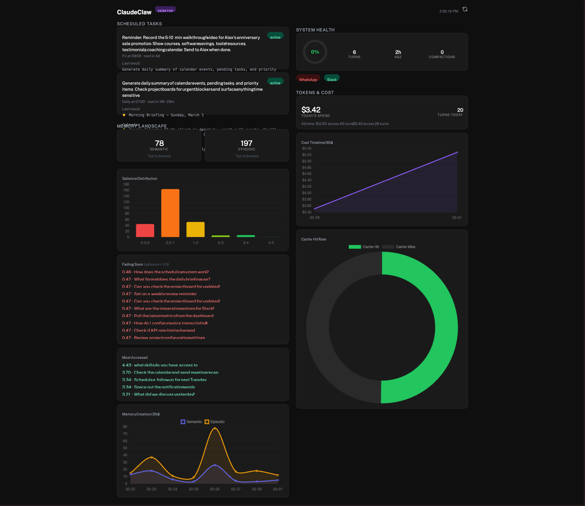
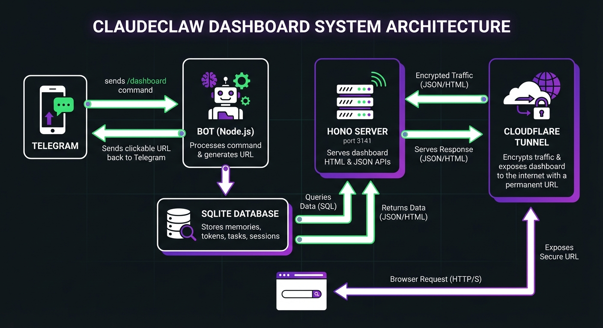

# ClaudeClaw Dashboard

A real-time web dashboard for your ClaudeClaw assistant. See your scheduled tasks, memories, token costs, and system health from your phone or desktop.



---

## How It Works



The dashboard is a lightweight web server that runs inside your existing ClaudeClaw bot process. Here's the flow:

1. **You send `/dashboard` in Telegram** - Your bot receives the command and replies with a clickable link
2. **You tap the link** - Your browser opens the dashboard URL
3. **Cloudflare Tunnel** (optional) - If you want to access the dashboard from your phone while away from home, a Cloudflare Tunnel encrypts the traffic and routes it through a permanent URL like `https://dash.yourdomain.com`. No ports are opened on your machine.
4. **Hono Server** (port 3141) - A tiny HTTP server running inside the bot process serves the dashboard HTML page and JSON API endpoints
5. **SQLite Database** - The server queries your existing ClaudeClaw database (`store/claudeclaw.db`) for memories, token usage, scheduled tasks, and session data
6. **Dashboard renders** - The HTML page fetches data from the API every 60 seconds and displays it with charts, gauges, and live countdowns

**Nothing leaves your machine unless you set up a tunnel.** Without a tunnel, the dashboard is only accessible at `localhost:3141` on the same computer running the bot.

---

## What You'll See

The dashboard has four sections:

| Section | What it shows |
|---------|--------------|
| **Scheduled Tasks** | Every task you've set up, whether it's active or paused, when it next runs (with a live countdown), and the result from its last run |
| **Memory Landscape** | How many semantic and episodic memories the bot has, which ones are fading (low salience), which are most accessed, and a 30-day timeline of memory creation |
| **System Health** | A circular gauge showing how much of the context window is used, session age, number of turns and compactions, and connection status for WhatsApp and Slack |
| **Tokens & Cost** | Today's spend and turn count, all-time totals, a 30-day cost chart, and a cache hit rate doughnut |

On mobile it's a single scrollable column. On desktop it splits into two columns automatically.

---

## Setup (Step by Step)

### Step 1: Install dependencies

Open your terminal, navigate to the ClaudeClaw folder, and run:

```bash
npm install
```

This downloads `hono` (the web server) and `@hono/node-server` (connects it to Node.js), along with everything else the bot needs.

**What could go wrong:**
- If you see permission errors, try `sudo npm install` (Mac/Linux) or run your terminal as Administrator (Windows)
- If `npm` isn't found, you need to install Node.js first: https://nodejs.org

### Step 2: Generate a secret token

The dashboard is protected by a token (like a password in the URL). Generate one:

```bash
node -e "console.log(require('crypto').randomBytes(24).toString('hex'))"
```

This prints a random 48-character string like `a3f8c2d1e5b7...`. Copy it.

**Why this matters:** Anyone with this token can view your dashboard. Treat it like a password. Don't share it publicly.

### Step 3: Add the token to your `.env` file

Open the `.env` file in your ClaudeClaw folder (create one from `.env.example` if it doesn't exist) and add:

```
DASHBOARD_TOKEN=paste_your_token_here
```

That's the only required setting. There are two optional ones:

```
DASHBOARD_PORT=3141          # Change if port 3141 is already in use
DASHBOARD_URL=               # Leave blank for now. Only set this if you set up a tunnel (Step 6)
```

### Step 4: Build and start the bot

```bash
npm run build
npm start
```

The first command compiles TypeScript into JavaScript. The second starts the bot (which now includes the dashboard server).

You should see a log line like:
```
Dashboard server running on port 3141
```

**What could go wrong:**
- Build errors usually mean a missing dependency. Run `npm install` again.
- "Port 3141 in use" means something else is using that port. Either stop it or change `DASHBOARD_PORT` in `.env`.

### Step 5: Open the dashboard

In your browser, go to:

```
http://localhost:3141/?token=YOUR_TOKEN&chatId=YOUR_CHAT_ID
```

Replace `YOUR_TOKEN` with the token from Step 2, and `YOUR_CHAT_ID` with the value of `ALLOWED_CHAT_ID` in your `.env`.

Or just send `/dashboard` to your bot in Telegram. It'll reply with a clickable link.

**At this point, the dashboard works on the same machine.** If you only want local access, you're done.

### Step 6 (Optional): Access from your phone with Cloudflare Tunnel

Without a tunnel, the dashboard only works on `localhost` (the machine running the bot). To open it from your phone anywhere in the world, you need a tunnel.

#### Option A: Quick tunnel (free, 2 minutes, temporary URL)

Best for: trying it out, no commitment.

```bash
# Install cloudflared (Mac)
brew install cloudflare/cloudflare/cloudflared

# Start a quick tunnel
cloudflared tunnel --url http://localhost:3141
```

It prints a random URL like `https://something-random.trycloudflare.com`.

Set that URL in your `.env`:
```
DASHBOARD_URL=https://something-random.trycloudflare.com
```

Restart the bot. Now `/dashboard` in Telegram gives a link that works from your phone.

**Downside:** The URL changes every time you restart `cloudflared`. You'll need to update `.env` each time.

#### Option B: Named tunnel (free, permanent URL, requires a domain)

Best for: a stable URL that never changes.

You need a domain registered through Cloudflare. Cheapest options: `.work`, `.xyz`, `.site` ($5-12/year). You can buy one directly at https://dash.cloudflare.com (go to Domain Registration > Register Domain).

Once you have a domain:

```bash
# 1. Install cloudflared
brew install cloudflare/cloudflare/cloudflared

# 2. Login to Cloudflare (opens your browser, pick your domain)
cloudflared tunnel login

# 3. Create a named tunnel
cloudflared tunnel create claudeclaw
# Note the tunnel ID it prints (looks like: d91b53dc-2ef6-4785-a9f9-a6f45e2bb6ec)

# 4. Route a subdomain to the tunnel
cloudflared tunnel route dns claudeclaw dash.yourdomain.com
```

Create a config file at `~/.cloudflared/config.yml`:

```yaml
tunnel: YOUR_TUNNEL_ID
credentials-file: /path/to/YOUR_TUNNEL_ID.json

ingress:
  - hostname: dash.yourdomain.com
    service: http://localhost:3141
  - service: http_status:404
```

Replace `YOUR_TUNNEL_ID` and the credentials path with the values printed by the `tunnel create` command.

Start the tunnel:

```bash
cloudflared tunnel run claudeclaw
```

Update your `.env`:
```
DASHBOARD_URL=https://dash.yourdomain.com
```

Restart the bot. Done. The URL is permanent.

**What could go wrong:**
- SSL certificate takes 1-5 minutes to provision on a brand new domain. If the browser shows an error, wait and refresh.
- macOS sometimes caches failed DNS lookups. If `curl` can't resolve the domain but your browser can, run: `sudo dscacheutil -flushcache && sudo killall -HUP mDNSResponder`

To run the tunnel automatically when your Mac starts:
```bash
brew services start cloudflared
```

#### Moving to a new machine

If you move your setup to a different computer (e.g., a Mac Mini):

1. Install `cloudflared` on the new machine
2. Copy `~/.cloudflared/config.yml` and the credentials JSON file
3. Run `cloudflared tunnel run claudeclaw`
4. No DNS changes needed. Same URL, same tunnel, different machine.

---

## Things to Be Aware Of

These aren't scary warnings. Just things worth knowing:

- **Your token is in the URL.** If someone gets your dashboard link, they can see your data. Don't post it publicly, don't share screenshots of the URL bar. The data shown is read-only (no one can modify anything through the dashboard), but your scheduled task prompts and memory content are visible.

- **Quick tunnel URLs are temporary.** If you use Option A and `cloudflared` restarts (e.g., after a reboot), you'll get a new URL. Your old Telegram links will stop working. Named tunnels (Option B) don't have this problem.

- **The dashboard runs inside the bot process.** If the bot crashes or stops, the dashboard goes down too. Restart the bot and the dashboard comes back.

- **No authentication beyond the token.** There's no username/password, no session expiry, no rate limiting. The 48-character token is the only gate. For a personal dashboard this is fine. If you want more security, Cloudflare Access (free for up to 50 users) can add login-based auth on top.

- **Data is real-time but cached for 60 seconds.** The dashboard auto-refreshes every 60 seconds. The data comes straight from SQLite queries. If you add a memory or complete a task, it'll show up within a minute.

- **Cloudflare Tunnel is encrypted end-to-end.** Traffic between your browser and the server is encrypted. No ports are opened on your machine. The tunnel URL is not discoverable by scanning. Cloudflare also automatically redacts your personal info from WHOIS records for domains registered through them.

---

## API Reference

All endpoints require `?token=YOUR_TOKEN`. Endpoints that query per-user data also need `&chatId=YOUR_CHAT_ID`.

| Endpoint | Description |
|----------|-------------|
| `GET /` | Dashboard HTML page |
| `GET /api/tasks` | All scheduled tasks with status, schedule, last result |
| `GET /api/memories?chatId=` | Memory stats, salience distribution, fading list, top accessed, creation timeline |
| `GET /api/memories/list?chatId=&sector=&limit=&offset=` | Paginated memory list by sector (for drill-down) |
| `GET /api/health?chatId=` | Context window gauge, session stats, connection status |
| `GET /api/tokens?chatId=` | Token/cost stats, 30-day cost timeline, cache hit rate |

---

## Under the Hood (for developers)

### Files Created

| File | Purpose |
|------|---------|
| `src/dashboard.ts` | Hono HTTP server, API routes, token auth middleware |
| `src/dashboard-html.ts` | Single exported HTML string. Tailwind CSS + Chart.js via CDN, vanilla JS, zero build step |

### Files Modified

| File | What changed |
|------|-------------|
| `src/config.ts` | Added `DASHBOARD_PORT`, `DASHBOARD_TOKEN`, `DASHBOARD_URL` |
| `src/db.ts` | Added 8 query functions for dashboard data |
| `src/index.ts` | Calls `startDashboard()` after `initDatabase()` |
| `src/bot.ts` | Added `/dashboard` command handler |
| `package.json` | Added `hono`, `@hono/node-server` |
| `.env.example` | Added dashboard env vars |

### Dependencies

| Package | Why |
|---------|-----|
| `hono` | Lightweight HTTP framework (like Express but faster and smaller) |
| `@hono/node-server` | Adapter to run Hono on Node.js |

### Database Queries

The dashboard reads (never writes) from these tables:

| Table | What the dashboard pulls |
|-------|------------------------|
| `scheduled_tasks` | Task name, cron, status, last result, next run |
| `memories` | Content, sector (semantic/episodic), salience score, creation date |
| `token_usage` | Input/output tokens, cost, cache hits, context size per turn |
| `sessions` | Active session ID, creation time |

### Gotchas We Hit During Development

| Issue | What happened | Fix |
|-------|--------------|-----|
| Template literal escaping | `onclick="this.classList.toggle('expanded')"` inside a TypeScript template literal broke the entire script block. The `\'` collapsed into raw `'` in rendered HTML. | Use `&quot;` for quotes inside onclick attributes |
| SSL cert delay | Brand new Cloudflare domains take 1-5 minutes for SSL cert provisioning. Browser shows error page until then. | Wait and refresh |
| macOS DNS cache | After creating a DNS record, `curl` fails with "Could not resolve host" even though `dig` works. macOS caches negative DNS lookups. | Wait, or flush: `sudo dscacheutil -flushcache && sudo killall -HUP mDNSResponder` |
| Quick tunnels aren't permanent | `cloudflared tunnel --url` gives a random URL that changes on every restart | Use named tunnels with DNS routes for a permanent URL |
